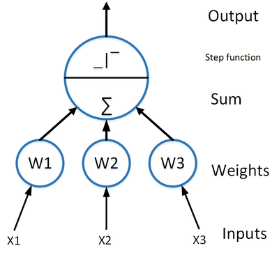
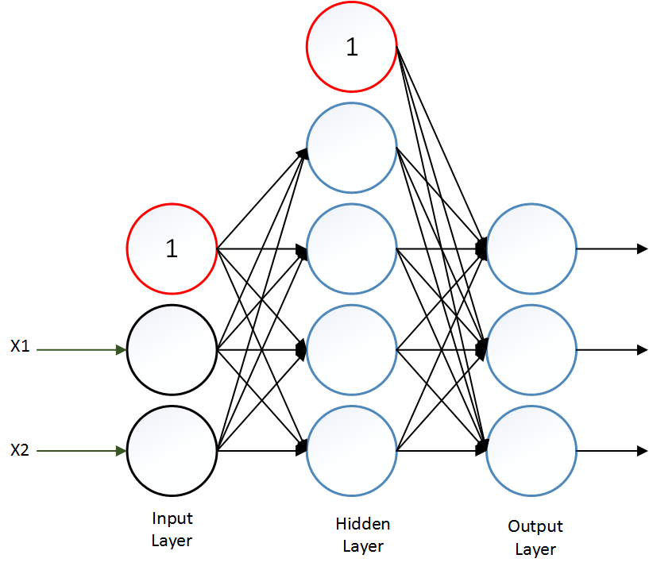

# Multi Layer Perceptron

One of the first ANN architectures, first presented in 1957 by Frank Rosenblatt in his paper "*The perceptron: a probabilistic model for information storage and organization in the brain*". It is based on a type of artificial neuron called a linear threshold unit (LTU):

The LTU computes a weighted sum of its inputs and then applies a step function to that sum and outputs the result.

The multi layer perceptron (MLP) original architecture, consisted of one input layer, one output layer and one or more hidden layers made of LTU, and every layer (except for the output layer) has a bias neuron, which is a constant value neuron.

The main problem that researchers had with the MLP architecture had was that they struggled to find a proper way to train them, but in 1986 D. E. Rumelhart published "*Learning representations by back-propagating errors*", a paper that  introduced the backpropagation training algorithm which was fundamental on the development of the MLP and deep learning in general.
In order for the backpropagation algorithm to work, the step function at the end of the units was replaced with the logistic function. The function at the end of the unit it's known as the activation function, and there's many others such as the hyperbolic tangent function or the rectified linear unit (ReLU).

